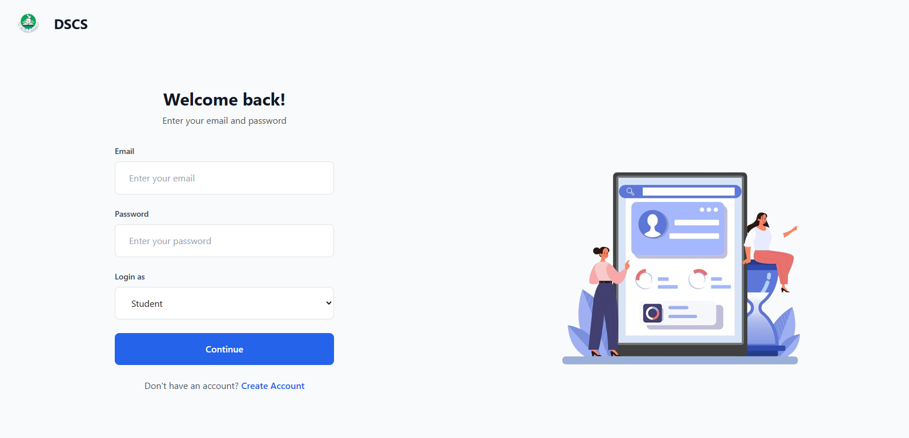
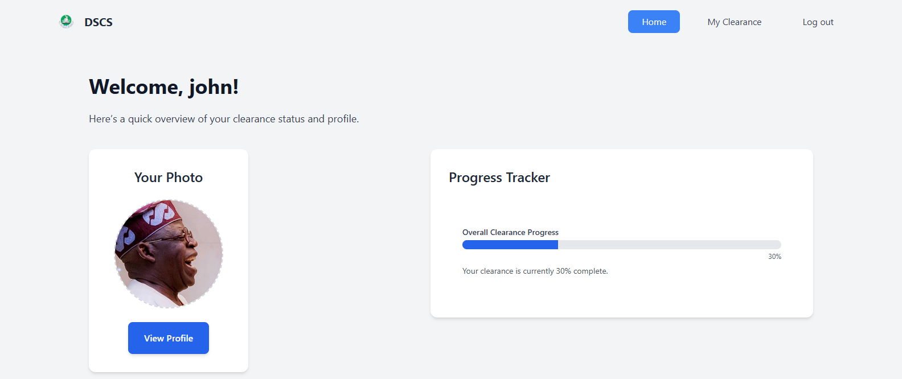
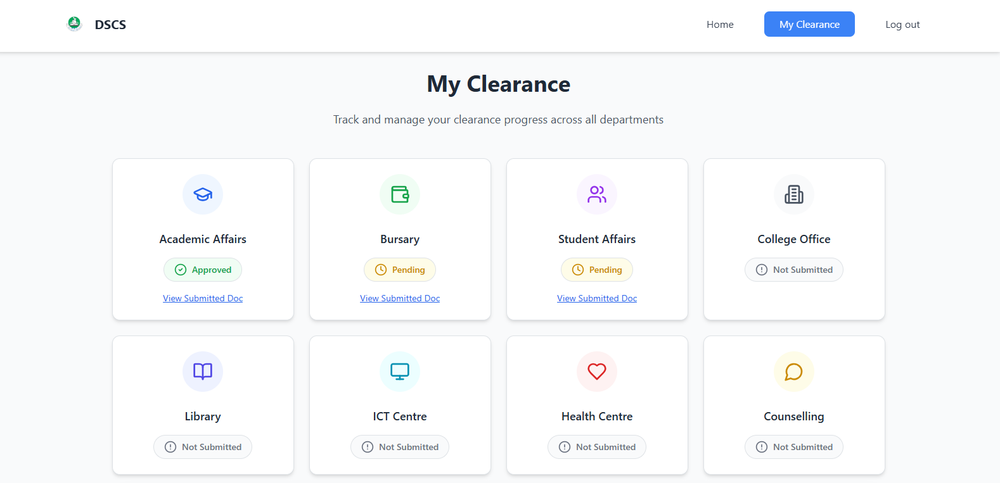
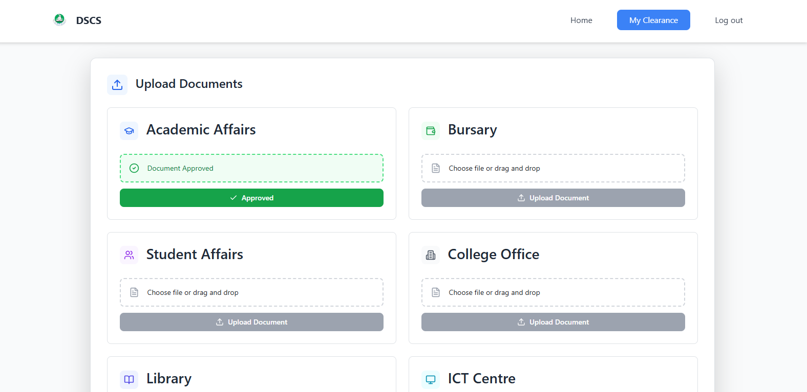
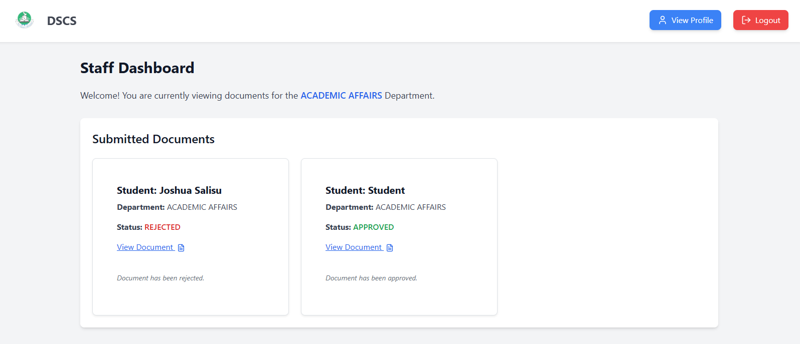
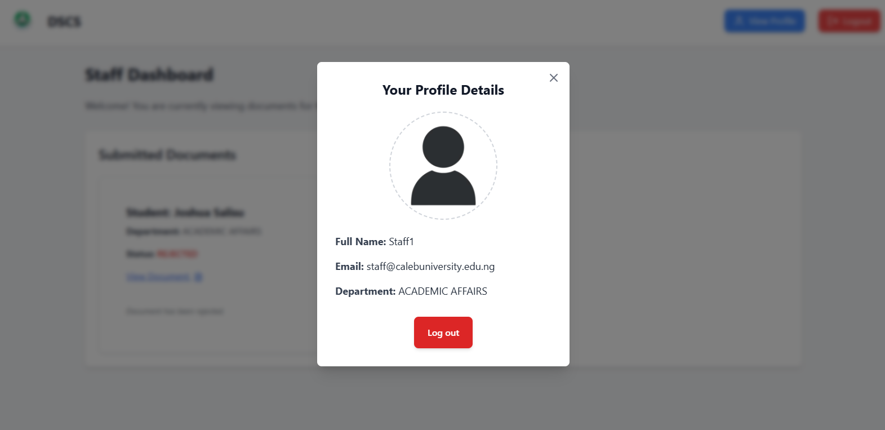
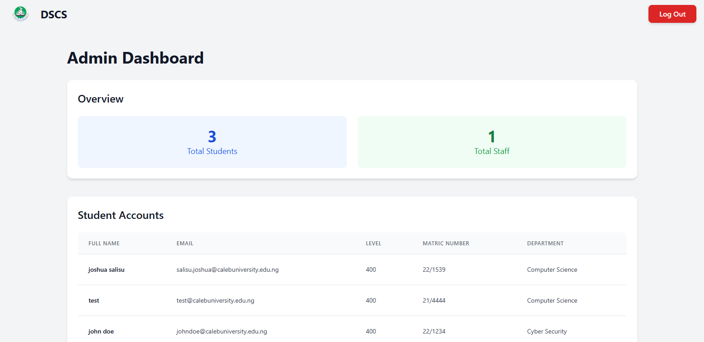

# 📠Digital Student Clearance System

A web-based digital clearance platform for universities, built with **React** and **TypeScript**, and powered by **Firebase** (Authentication & Firestore) and **Cloudinary** (for secure document uploads). The system streamlines the clearance process for students, reducing paperwork and administrative delays.

---

## 📸 Screenshots

### 🔠Landing Page


### 🔠Login Page


### 🧾 Student Page


### 📤 Student Clearance


### 📤 Document Upload


### 📤 Staff Page


### 📤 Staff Details


### 📤 Admin Page


---
## 🚀 Features

- 🔠Role-based authentication (Student, Staff, Admin)
- 📄 Document upload and management via Cloudinary
- ✅ Department-level clearance tracking
- 🔠Staff view of relevant student submissions
- âš™ï¸ Firebase Firestore integration for real-time data updates
- 🧾 Activity and clearance status monitoring

---

## ğŸ› ï¸ Tech Stack

- **Frontend:** React + TypeScript
- **Backend (BaaS):** Firebase (Auth, Firestore)
- **File Storage:** Cloudinary
- **Styling:** Tailwind CSS (optional)
- **State Management:** React Hooks, Context API 

---

## 🧪 Installation & Setup

```bash
# Clone the repository
git clone https://github.com/chuka-obiago/digital-student-clearance-system.git
cd your-repo-name

# Install dependencies
npm install

# Start the development server
npm run dev
